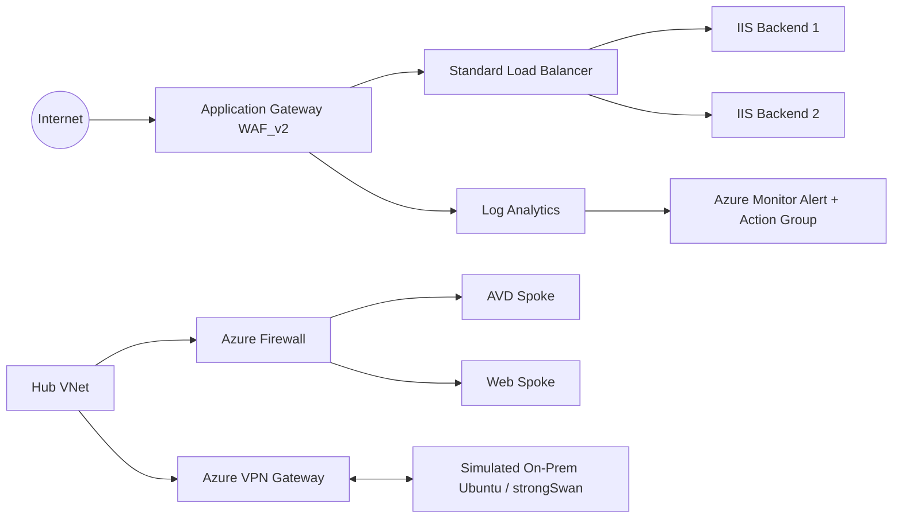

# Azure Networking Capstone

End-to-end Azure networking and security lab demonstrating practical skills in Azure networking, routing, hybrid connectivity, load balancing, web application security, monitoring, and troubleshooting.

> **Lab environment:** This project was built in a personal Azure lab environment, not production.

## What I Built

- Hub-and-spoke virtual network architecture
- Azure Firewall with forced routing / user-defined routes
- Network Security Groups (NSGs)
- Azure Virtual Desktop connectivity validation
- Simulated on-premises environment with Ubuntu + strongSwan
- Site-to-site VPN to Azure VPN Gateway
- Two Windows Server IIS web backends
- Azure Standard Load Balancer
- Azure Application Gateway WAF_v2
- WAF policy in Prevention mode
- Log Analytics diagnostic logging
- KQL queries for access and WAF events
- Azure Monitor alerting with email and SMS notifications

## Architecture

## Validation Performed

- Verified both IIS backends were healthy.
- Stopped one IIS backend and confirmed the application remained available.
- Restored the backend and confirmed both servers returned to healthy state.
- Enabled WAF Prevention mode.
- Sent a harmless XSS-style test request and received `403 Forbidden`.
- Confirmed WAF events appeared in `AGWFirewallLogs`.
- Confirmed normal traffic appeared in `AGWAccessLogs`.
- Created an Azure Monitor alert for blocked WAF requests.
- Confirmed the Action Group delivered both email and SMS notifications.

## Monitoring

See [`monitoring/kql-queries.md`](monitoring/kql-queries.md).

## Troubleshooting Highlights

This project intentionally included troubleshooting instead of only successful deployments. Examples included missing NSG/subnet associations, incorrect UDR next hops, forced-routing issues, StrongSwan/IPsec mismatches, Application Gateway health-probe configuration, backend failover, and WAF validation.

See [`troubleshooting/lessons-learned.md`](troubleshooting/lessons-learned.md).

## Screenshots

Place sanitized proof screenshots in the `screenshots/` folder. Two sanitized alert examples are included in this starter package.

## Security / Sanitization

Do **not** publish subscription IDs, tenant IDs, shared keys / PSKs, SSH private keys, passwords, personal email addresses, phone numbers, or other reusable credentials.

## Skills Demonstrated

Azure networking, Azure Firewall, NSGs, UDRs, VPN Gateway, strongSwan, hybrid connectivity, Azure Load Balancer, Application Gateway, WAF_v2, IIS, Log Analytics, KQL, Azure Monitor, alerting, and troubleshooting.
