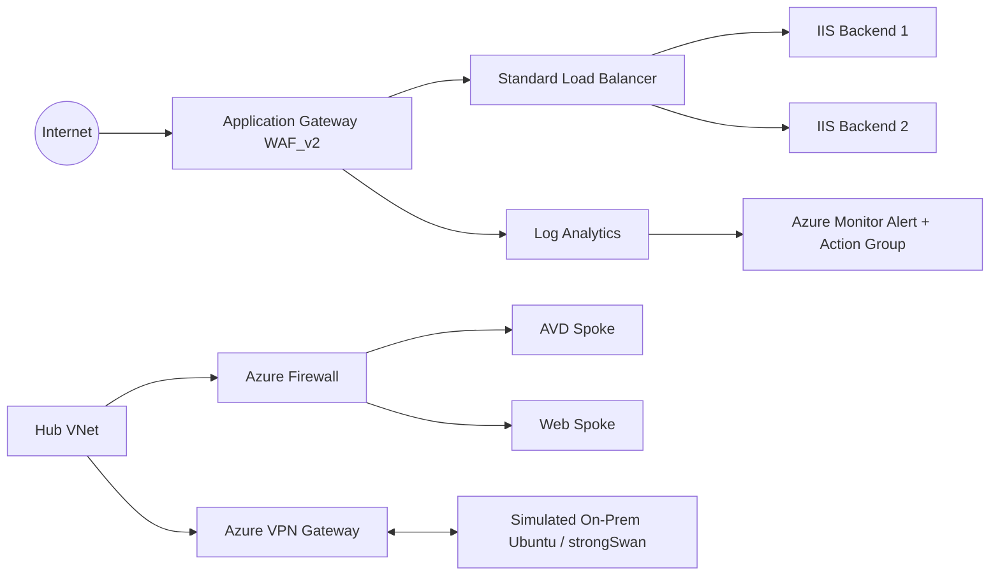
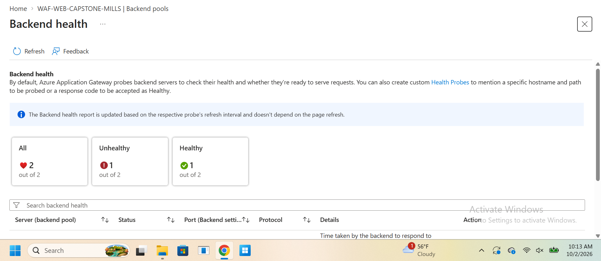
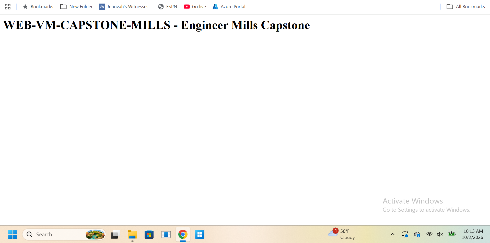
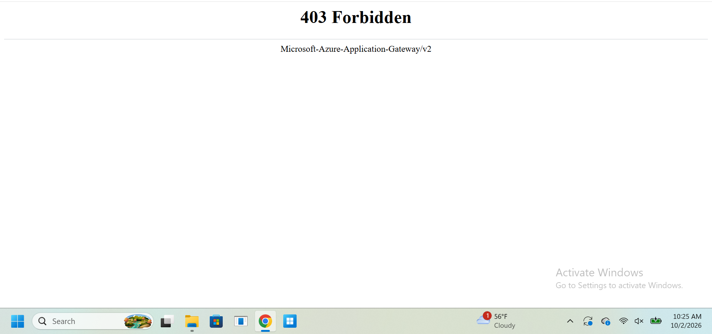
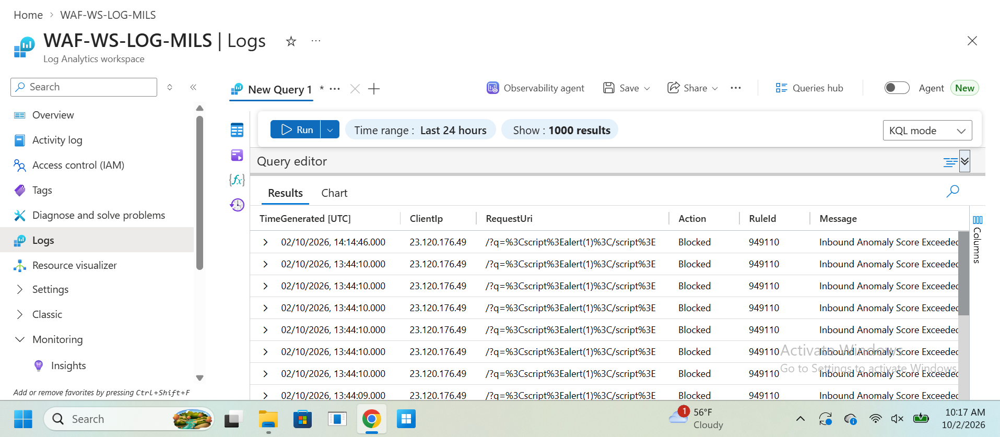
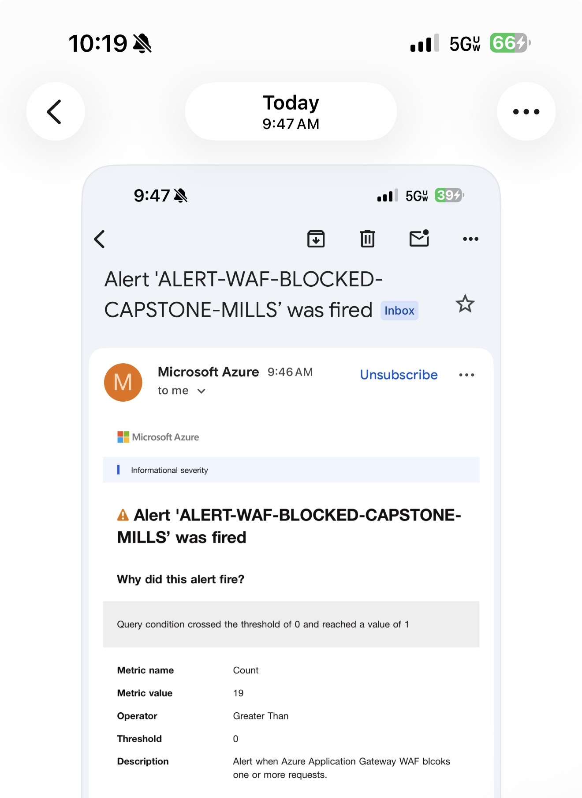

# Azure Networking Capstone

End-to-end Azure networking and security lab demonstrating practical skills in Azure networking, routing, hybrid connectivity, load balancing, web application security, monitoring, and troubleshooting.

> **Lab environment:** This project was built in a personal Azure lab environment, not production.

## What I Built

- Hub-and-spoke virtual network architecture
- Azure Firewall with forced routing / user-defined routes
- Network Security Groups (NSGs)
- Azure Virtual Desktop connectivity validation
- Simulated on-premises environment with Ubuntu + strongSwan
- Site-to-site VPN to Azure VPN Gateway
- Two Windows Server IIS web backends
- Azure Standard Load Balancer
- Azure Application Gateway WAF_v2
- WAF policy in Prevention mode
- Log Analytics diagnostic logging
- KQL queries for access and WAF events
- Azure Monitor alerting with email and SMS notifications

## Architecture

## Project Evidence

The following screenshots demonstrate availability testing, WAF enforcement, centralized logging, and automated alerting within the capstone environment.

### Application Gateway Backend Health / Failover Test

One IIS backend was intentionally taken offline. Azure Application Gateway detected the failed backend through its health probe while the second backend remained healthy and available to serve traffic.

Despite one backend being unhealthy, the application remained available through the surviving IIS backend.

### WAF Prevention Mode Blocking

A harmless XSS-style request was sent through Azure Application Gateway while the WAF policy was operating in **Prevention** mode. The request was successfully blocked with an HTTP **403 Forbidden** response.

### WAF Events in Log Analytics

Application Gateway diagnostic logs were forwarded to Azure Log Analytics. KQL queries confirmed that the test requests were recorded as **Blocked** events and identified the corresponding WAF rule.

### Azure Monitor Automated Alerting

An Azure Monitor log alert was configured to trigger whenever one or more blocked WAF requests were detected. The alert successfully fired and delivered a notification through the configured Action Group.

> **Result:** The capstone validated backend health monitoring and failover, WAF enforcement, centralized security logging, KQL-based analysis, and automated Azure Monitor alerting end-to-end.
## Validation Performed

- Verified both IIS backends were healthy.
- Stopped one IIS backend and confirmed the application remained available.
- Restored the backend and confirmed both servers returned to healthy state.
- Enabled WAF Prevention mode.
- Sent a harmless XSS-style test request and received `403 Forbidden`.
- Confirmed WAF events appeared in `AGWFirewallLogs`.
- Confirmed normal traffic appeared in `AGWAccessLogs`.
- Created an Azure Monitor alert for blocked WAF requests.
- Confirmed the Action Group delivered both email and SMS notifications.

## Monitoring

See [`monitoring/kql-queries.md`](monitoring/kql-queries.md).

## Troubleshooting Highlights

This project intentionally included troubleshooting instead of only successful deployments. Examples included missing NSG/subnet associations, incorrect UDR next hops, forced-routing issues, StrongSwan/IPsec mismatches, Application Gateway health-probe configuration, backend failover, and WAF validation.

See [`troubleshooting/lessons-learned.md`](troubleshooting/lessons-learned.md).

## Additional Screenshots

Additional sanitized deployment and validation screenshots are available in the [`screenshots`](screenshots/) directory.

## Security / Sanitization

Do **not** publish subscription IDs, tenant IDs, shared keys / PSKs, SSH private keys, passwords, personal email addresses, phone numbers, or other reusable credentials.

## Skills Demonstrated

Azure networking, Azure Firewall, NSGs, UDRs, VPN Gateway, strongSwan, hybrid connectivity, Azure Load Balancer, Application Gateway, WAF_v2, IIS, Log Analytics, KQL, Azure Monitor, alerting, and troubleshooting.
